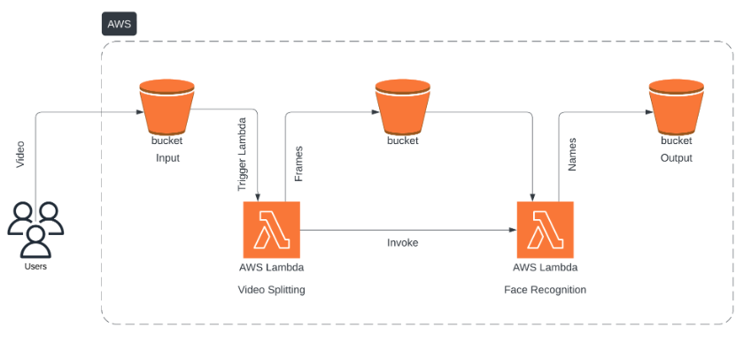

# Serverless-Face-Recognition-System-using-AWS-Lambda
# Serverless Face Recognition Platform

## Introduction

The Serverless Face Recognition Platform is an AWS-powered, event-driven application that processes video uploads to detect and recognize faces without the need for traditional server management. This solution leverages serverless computing to split videos into frames and apply a deep learning model for face recognition, ensuring smooth scalability and efficient processing.

## Features

- **Serverless Operation**: Utilizes AWS Lambda to handle processing tasks, eliminating the need for dedicated servers.
- **Event-Triggered Processing**: Automatically kicks off the video analysis workflow when a new video is uploaded to an S3 bucket.
- **Deep Learning Integration**: Employs a pre-trained ResNet-34 model via PyTorch for robust face recognition.
- **Cloud Storage**: Manages video files, extracted frames, and results using Amazon S3.
- **Optimized Frame Analysis**: Uses FFmpeg for video frame extraction and OpenCV for face detection.

## Architecture Overview

### Video Frame Extraction

- **Lambda Function**: `lambda_video_splitting.py`
- **Directory**: `src/`
- **Functionality**:  
  When a video is uploaded, this function is triggered via an S3 event. It employs FFmpeg to break the video into individual frames, which are then saved to an intermediary S3 bucket.

### Face Recognition Process

- **Lambda Function**: `lambda_handler.py`
- **Directory**: `src/`
- **Functionality**:  
  This function retrieves the extracted frames from the first S3 bucket, detects faces using OpenCV, and recognizes them using a ResNet-34 model. The final output, which includes the recognition details, is stored as a text file in a designated output bucket.

### Supporting Deployment Files

- **Docker Configuration**
  - **File**: `Dockerfile`
  - **Directory**: `src/`
  - **Purpose**: Provides container settings for the face recognition Lambda function, ensuring consistency during deployment.
  
- **Dependencies List**
  - **File**: `requirements.txt`
  - **Directory**: `src/`
  - **Purpose**: Lists all the necessary Python packages, such as `boto3`, `imutils`, `Pillow`, `opencv-python-headless`, and `facenet-pytorch`, required for the Lambda function.

## Workflow

1. **Video Upload**: A user uploads a video to a specified S3 bucket.
2. **Frame Extraction**: The upload event triggers `lambda_video_splitting.py`, which splits the video into frames and saves them to an intermediary S3 bucket.
3. **Face Recognition**: The extracted frames are processed by `lambda_handler.py` to detect and recognize faces.
4. **Results Storage**: Recognition results are compiled and stored as a text file in the output S3 bucket.

## License

This project is licensed under the [MIT License](LICENSE).
